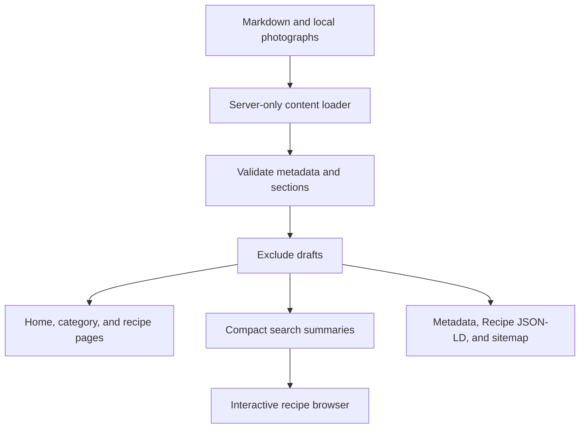

# Architecture and file structure

Status: implemented locally. Last updated: 2026-09-05. Deployment remains unconfigured.

## Repository structure

```text
foodblog/
├── content/
│   ├── recipes/                  Six individual .md recipe files
│   │   └── mushroom-sage-pasta.md
│   └── pages/about.md
├── docs/                         Project documentation
├── public/images/recipes/        Local photographs and photography.credits.md
├── scripts/validate-content.ts  Standalone content validation command
├── src/
│   ├── app/
│   │   ├── layout.tsx           Fonts, shared navigation, footer, default metadata
│   │   ├── page.tsx             Hero and latest recipe list
│   │   ├── globals.css          Theme, layout, responsive and print styles
│   │   ├── icon.svg             Journal favicon
│   │   ├── not-found.tsx
│   │   ├── sitemap.ts
│   │   ├── robots.ts
│   │   ├── about/page.tsx
│   │   └── recipes/
│   │       ├── page.tsx
│   │       ├── [slug]/page.tsx
│   │       └── category/[category]/page.tsx
│   ├── components/
│   │   ├── layout/
│   │   │   ├── site-header.tsx
│   │   │   ├── mobile-nav.tsx
│   │   │   └── site-footer.tsx
│   │   ├── recipes/
│   │   │   ├── recipe-card.tsx   Card and shared grid
│   │   │   ├── recipe-browser.tsx
│   │   │   ├── recipe-body.tsx
│   │   │   ├── ingredient-checklist.tsx
│   │   │   └── print-button.tsx
│   │   ├── content/markdown.tsx
│   │   └── ui/                  Generated shadcn controls
│   ├── lib/
│   │   ├── content/
│   │   │   ├── recipes.ts       Server-only loader and public queries
│   │   │   ├── pages.ts         About loader
│   │   │   ├── schema.ts        Frontmatter validation and metadata types
│   │   │   └── markdown.ts      AST parsing and recipe-section extraction
│   │   ├── recipe-search.ts
│   │   ├── recipe-seo.ts
│   │   └── utils.ts
│   └── config/
│       ├── site.ts
│       └── categories.ts
├── tests/
│   ├── content.test.ts
│   ├── recipe-search.test.ts
│   └── recipe-flow.spec.ts
├── AGENTS.md / CLAUDE.md         Framework agent guidance
├── components.json              shadcn configuration
├── eslint.config.mjs
├── next.config.ts
├── package.json / package-lock.json
├── playwright.config.ts
├── postcss.config.mjs
├── tsconfig.json
└── README.md
```

Generated dependencies, build output, screenshots, and traces are excluded from this tree. The original starter assets remain unused in `public/`; the journal uses its own icon and recipe photographs.

## Technical choices

| Concern | Implementation |
| --- | --- |
| Routing | Next.js App Router with statically generated recipe/category pages |
| Content | Local `.md` files with YAML frontmatter |
| Metadata parsing | gray-matter |
| Validation | Strict Zod schemas plus filename, image, date, and recipe-section checks |
| Markdown | unified, remark-parse, remark-stringify, and mdast-util-to-string; react-markdown renders content |
| UI | Tailwind theme and shadcn/ui with Radix; Lora headings and DM Sans body via next/font |
| Search | Browser filtering over compact published summaries |
| Images | Local files, optimized with Next.js Image |
| Persistence | Repository files; transient ingredient-checkbox state |
| Tests | Node test runner with tsx, and Playwright against a production build |

## Content flow



`getRecipes` is the shared published-content query used by routes, related recipes, search, and sitemap generation. React cache deduplicates calls within a server render. `loadRecipes` validates all files, including drafts, and is also used by the authoring command.

Slugs come from validated filenames. Recipe lookups search the known collection; arbitrary URL segments are never joined to file paths. Image paths must match the local recipe-image convention and point to a file. Validation errors include the recipe filename.

## Server and browser responsibilities

Server components load content, render the main pages, and generate metadata. Only the recipe browser, mobile menu, ingredient checkboxes, and print button need browser interactions.

The recipe browser receives summaries containing slug, title, description, date, category, tags, image details, total time, and ingredient text. It uses the URL as the source of truth: typing replaces the current query state, while category selection and reset create history entries. Browser back/forward and refresh restore the selection.

The recipe index uses a Suspense boundary around URL-dependent controls with an initially rendered recipe grid as its fallback. Ingredient checkboxes are transient; a fresh recipe visit starts unchecked. Print styles hide controls and remove ingredient strikethroughs.

## Content rendering

A Markdown syntax tree identifies Ingredients, Method, and optional Notes. The extracted data powers the cooking layout, ingredient search, and Recipe JSON-LD, so authors maintain one recipe copy. Method formatting is preserved through Markdown serialization. Ingredients render as plain text labels.

Raw HTML and level-one body headings are rejected. No JSX or executable MDX is evaluated. react-markdown retains its safe URL handling. JSON-LD is serialized with less-than characters escaped so content cannot close the script element.

## Publishing and hosting

`generateStaticParams` generates published recipe routes and nonempty category routes. Unknown or draft recipe slugs return 404. Adding or editing content requires a successful build and deployment to change the public site.

The project uses a normal Next.js production build. No hosting provider is linked. Static-export hosting would require a separate decision about image optimization and runtime behavior.

Set `SITE_URL` before the production build to generate canonical and sitemap URLs for the real domain. Recipe modification dates come from `updated` or `date`. Site identity is in `src/config/site.ts`; the current name and collection are sample content.

## Framework references

Routing conventions were checked against installed Next.js documentation and current Context7 results.

- [Project structure](https://nextjs.org/docs/app/getting-started/project-structure)
- [Static route parameters](https://nextjs.org/docs/app/api-reference/functions/generate-static-params)
- [Metadata](https://nextjs.org/docs/app/api-reference/functions/generate-metadata)
- [Sitemap convention](https://nextjs.org/docs/app/api-reference/file-conventions/metadata/sitemap)
- [shadcn/ui installation](https://ui.shadcn.com/docs/installation/next)
