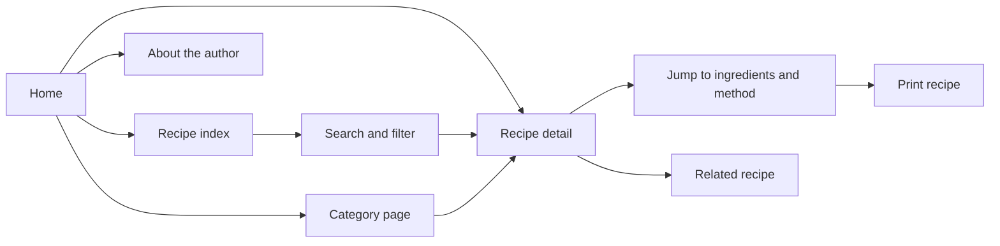

# Site map

Status: implemented locally. Routes and navigation below reflect the working site.

## Public pages

```text
Home                                 /
├── Recipes                          /recipes
│   ├── Category                     /recipes/category/[category]
│   │   └── Recipe                   /recipes/[slug]
│   └── Recipe                       /recipes/[slug]
└── About                            /about

Supporting endpoints
├── XML sitemap                      /sitemap.xml
├── Crawler rules                    /robots.txt
└── Not-found experience             Any unknown page URL
```

The same recipe is linked from several places but has one canonical URL. Its category is not part of its recipe URL, so recategorizing it does not break links.

## Routes and responsibilities

| URL | Main content and actions | Content source |
| --- | --- | --- |
| `/` | Hero section, followed directly by the latest recipe list and a link to all recipes | Site configuration and published recipe metadata |
| `/recipes` | All recipes, search, category filter, result count, clear-filters action, empty state | Published recipe summaries |
| `/recipes/category/[category]` | Category title, description, matching recipe cards | Category configuration and published recipe summaries |
| `/recipes/[slug]` | Title, summary, image, author, dates, times, servings, story, ingredients, method, notes, related recipes | One Markdown recipe and related summaries |
| `/about` | Author introduction, food philosophy, optional photograph | `content/pages/about.md` |
| `/sitemap.xml` | Canonical URLs for public pages, published recipes, nonempty categories | Content loader and site URL configuration |
| `/robots.txt` | Crawl rules and sitemap location | Site URL configuration |

Unknown recipe and category slugs return a proper 404 with links to the index. Draft recipe URLs also return 404 in the public site. A not-found page is a response state, not a navigation destination.

## Navigation

- Header: brand links to Home; primary links are Recipes and About.
- Mobile: the same links in an accessible compact menu when needed.
- Footer: Home, Recipes, About, and the configured author/site name.
- Recipe breadcrumb: Home → Recipes → Category → Recipe title.
- Category breadcrumb: Home → Recipes → Category title.
- Recipe actions: Jump to recipe, Print recipe, and related recipe links.

Categories are discoverable through recipe-card category links and the recipe index. Avoid filling the main navigation with every category.

## Search and filtering

Search lives on the index; there is no separate search page initially. Example shareable state: `/recipes?q=lemon&category=mains`.

- Match title, description, tags, and ingredient text, ignoring case and surrounding whitespace.
- Combine search and category selection: results must satisfy both.
- Order by publication date, newest first, with slug as a stable tie-breaker.
- Preserve query and category in the URL so refresh and browser navigation restore the selection.
- An unknown category filter yields an empty state with a reset action; an unknown category page yields 404.
- Filtered index URLs have a canonical link to `/recipes`; only canonical pages enter the sitemap.
- Create category pages only for categories containing published recipes.

## Page outlines

### Home

Header → hero section → recipe list → footer.

The hero-first, recipes-second order is implemented:

- **Hero:** a clear headline, short introduction, and food photograph. The “Browse the recipes” link scrolls to `#recipes`. The featured recipe supplies the photograph and its linked caption.
- **Recipe list:** directly below the hero, show the six latest published recipes, newest first. Each entry includes its photograph, title, description, category, and total time. The grid uses three columns on wide screens, two on tablets, and one on phones.
- **Browse all:** a link from the list leads to `/recipes`, where search and category filters live.

There is no category strip, author section, or promotional content between the hero and recipe list. The author introduction lives on About. The homepage limit is set in `src/app/page.tsx`.

### Recipe index and category pages

Header → breadcrumb where applicable → title and introduction → discovery controls on the index → result count → recipe grid or empty state → footer.

### Recipe detail

Header → breadcrumb → title and summary → times and servings → jump/print actions → photograph → Markdown story → ingredients and numbered method → notes → related recipes → footer.

The recipe section has a stable `#recipe` anchor. Printing keeps the title, source URL, times, servings, ingredients, method, and notes, and hides navigation and related cards.

## Reader journeys



## Possible later routes

`/journal`, `/journal/[slug]`, and `/saved` are ideas only. They are excluded from the initial navigation and folder structure.
